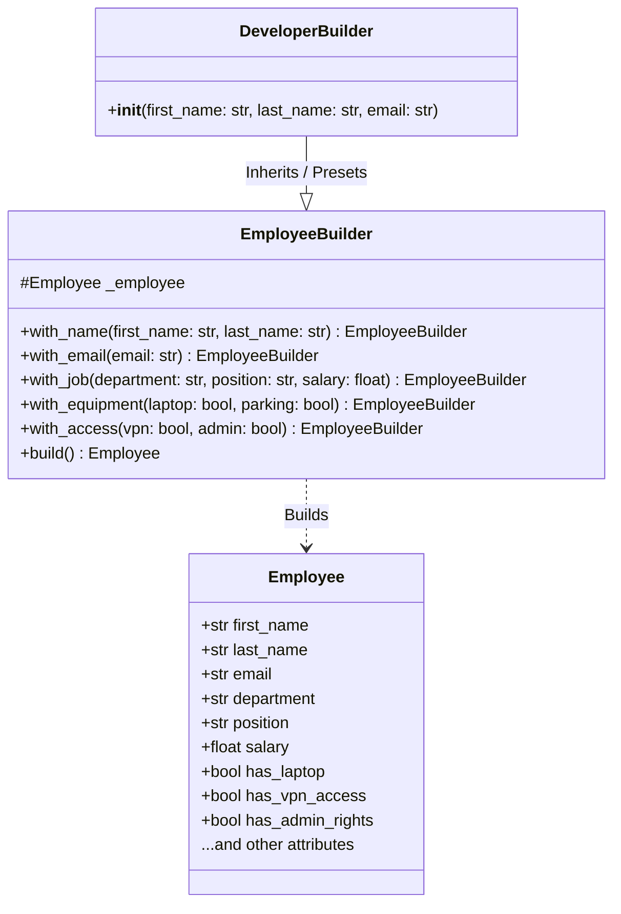

```mermaid

classDiagram
    class Employee {
        +str first_name
        +str last_name
        +str email
        +str department
        +str position
        +float salary
        +bool has_laptop
        +bool has_vpn_access
        +bool has_admin_rights
        ...and other attributes
    }

    class EmployeeBuilder {
        #Employee _employee
        +with_name(first_name: str, last_name: str) EmployeeBuilder
        +with_email(email: str) EmployeeBuilder
        +with_job(department: str, position: str, salary: float) EmployeeBuilder
        +with_equipment(laptop: bool, parking: bool) EmployeeBuilder
        +with_access(vpn: bool, admin: bool) EmployeeBuilder
        +build() Employee
    }

    class DeveloperBuilder {
        +__init__(first_name: str, last_name: str, email: str)
    }

    EmployeeBuilder ..> Employee : Builds
    DeveloperBuilder --|> EmployeeBuilder : Inherits / Presets
```
    
