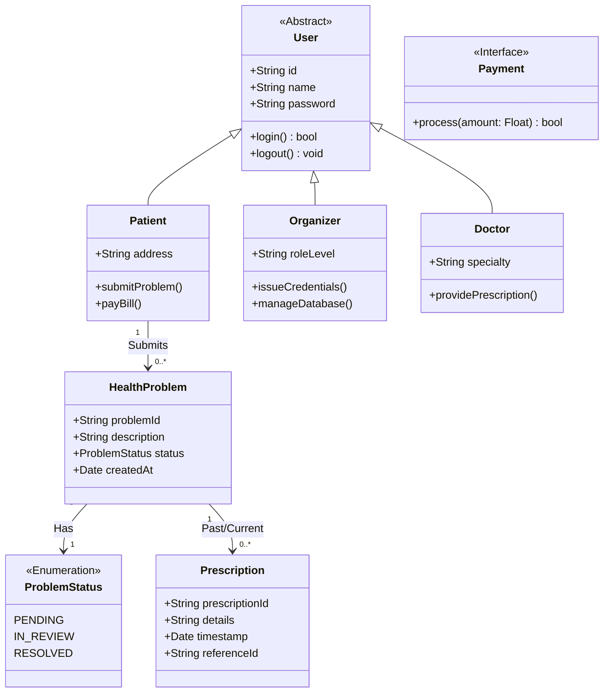
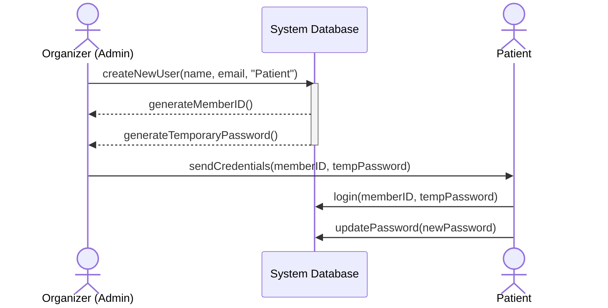
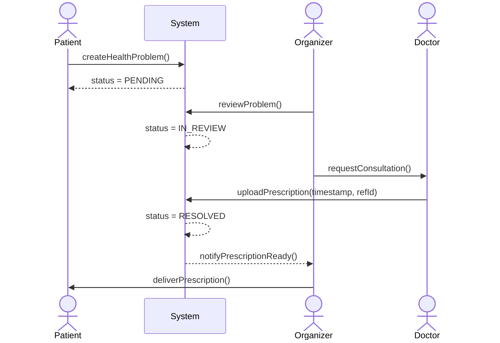
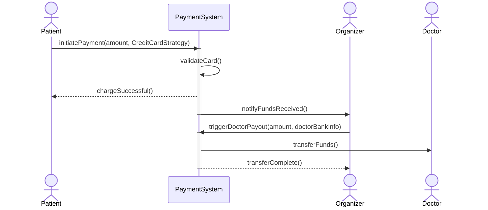

# Final Class Diagram

```mermaid

classDiagram
    class User {
        <<Abstract>>
        +String id
        +String name
        +String password
        +login() bool
        +logout() void
    }

    class Patient {
        +String address
        +submitProblem()
        +payBill()
    }

    class Organizer {
        +String roleLevel
        +issueCredentials()
        +manageDatabase()
    }

    class Doctor {
        +String specialty
        +providePrescription()
    }

    User <|-- Patient
    User <|-- Organizer
    User <|-- Doctor

    class ProblemStatus {
        <<Enumeration>>
        PENDING
        IN_REVIEW
        RESOLVED
    }

    class HealthProblem {
        +String problemId
        +String description
        +ProblemStatus status
        +Date createdAt
    }

    class Prescription {
        +String prescriptionId
        +String details
        +Date timestamp
        +String referenceId
    }

    class Payment {
        <<Interface>>
        +process(amount: Float) bool
    }

    Patient "1" --> "0..*" HealthProblem : Submits
    HealthProblem "*" --> "1" ProblemStatus : Has
    HealthProblem "1" --> "0..*" Prescription : Past/Current

```
# System Sequence Diagram: Patient Registration

```mermaid
sequenceDiagram
    actor Admin as Organizer (Admin)
    participant DB as System Database
    actor P as Patient

    Admin->>DB: createNewUser(name, email, "Patient")
    activate DB
    DB-->>Admin: generateMemberID()
    DB-->>Admin: generateTemporaryPassword()
    deactivate DB
    Admin->>P: sendCredentials(memberID, tempPassword)
    P->>DB: login(memberID, tempPassword)
    P->>DB: updatePassword(newPassword)

```

# System Sequence Diagram: Consultation Flow

```mermaid

sequenceDiagram
    actor P as Patient
    participant Sys as System
    actor O as Organizer
    actor D as Doctor

    P->>Sys: createHealthProblem()
    Sys-->>P: status = PENDING
    O->>Sys: reviewProblem()
    Sys-->>Sys: status = IN_REVIEW
    O->>D: requestConsultation()
    D->>Sys: uploadPrescription(timestamp, refId)
    Sys-->>Sys: status = RESOLVED
    Sys-->>O: notifyPrescriptionReady()
    O->>P: deliverPrescription()

```

# System Sequence Diagram: Payment Processing

```mermaid

sequenceDiagram
    actor P as Patient
    participant Sys as PaymentSystem
    actor O as Organizer
    actor D as Doctor

    P->>Sys: initiatePayment(amount, CreditCardStrategy)
    activate Sys
    Sys->>Sys: validateCard()
    Sys-->>P: chargeSuccessful()
    Sys->>O: notifyFundsReceived()
    deactivate Sys
    O->>Sys: triggerDoctorPayout(amount, doctorBankInfo)
    activate Sys
    Sys->>D: transferFunds()
    Sys-->>O: transferComplete()
    deactivate Sys


```
