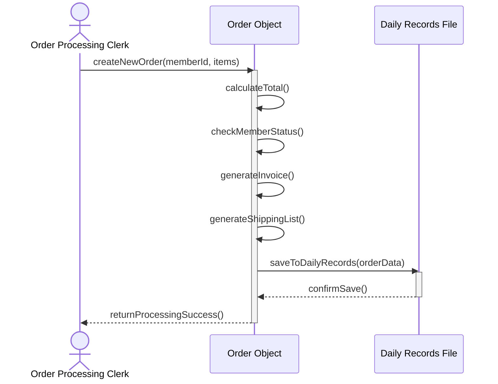
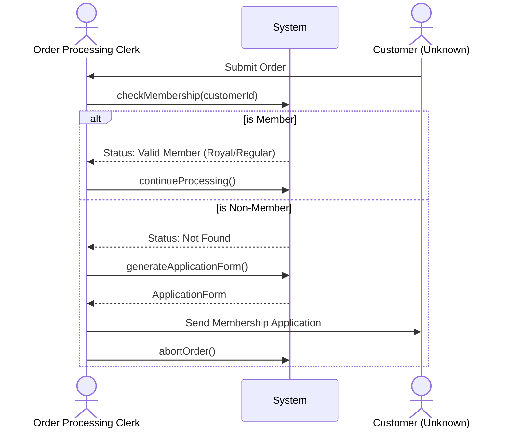
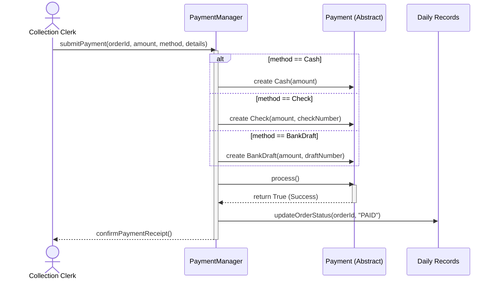
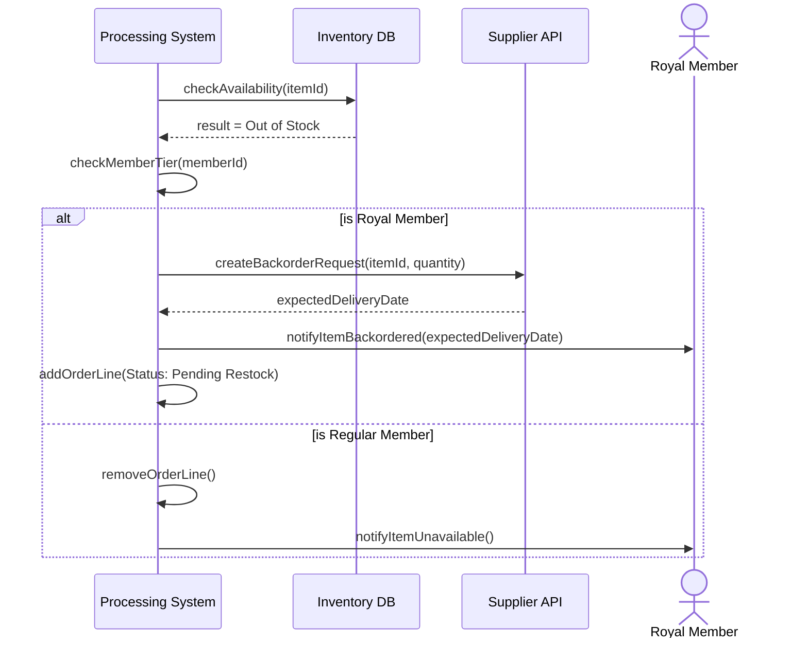

# 1. Complete Order Processing Flow

```mermaid
sequenceDiagram
    actor Clerk as Order Processing Clerk
    participant Order as Order Object
    participant DB as Daily Records File
    
    Clerk->>Order: createNewOrder(memberId, items)
    activate Order
    Order->>Order: calculateTotal()
    Order->>Order: checkMemberStatus()
    Order->>Order: generateInvoice()
    Order->>Order: generateShippingList()
    Order->>DB: saveToDailyRecords(orderData)
    activate DB
    DB-->>Order: confirmSave()
    deactivate DB
    Order-->>Clerk: returnProcessingSuccess()
    deactivate Order

```

# 2. Membership Verification (Success and Failure)

```mermaid
sequenceDiagram
    actor Clerk as Order Processing Clerk
    participant Sys as System
    actor Customer as Customer (Unknown)

    Customer->>Clerk: Submit Order
    Clerk->>Sys: checkMembership(customerId)
    
    alt is Member
        Sys-->>Clerk: Status: Valid Member (Royal/Regular)
        Clerk->>Sys: continueProcessing()
    else is Non-Member
        Sys-->>Clerk: Status: Not Found
        Clerk->>Sys: generateApplicationForm()
        Sys-->>Clerk: ApplicationForm
        Clerk->>Customer: Send Membership Application
        Clerk->>Sys: abortOrder()
    end

```

# 3. Payment Processing (All Types via Polymorphism)

```mermaid

sequenceDiagram
    actor CC as Collection Clerk
    participant PM as PaymentManager
    participant P as Payment (Abstract)
    participant DB as Daily Records

    CC->>PM: submitPayment(orderId, amount, method, details)
    activate PM
    
    alt method == Cash
        PM->>P: create Cash(amount)
    else method == Check
        PM->>P: create Check(amount, checkNumber)
    else method == BankDraft
        PM->>P: create BankDraft(amount, draftNumber)
    end
    
    PM->>P: process()
    activate P
    P-->>PM: return True (Success)
    deactivate P
    
    PM->>DB: updateOrderStatus(orderId, "PAID")
    PM-->>CC: confirmPaymentReceipt()
    deactivate PM

```

# 4. Item Reordering for Royal Members

```mermaid

sequenceDiagram
    participant Sys as Processing System
    participant Inv as Inventory DB
    participant Sup as Supplier API
    actor RM as Royal Member

    Sys->>Inv: checkAvailability(itemId)
    Inv-->>Sys: result = Out of Stock
    
    Sys->>Sys: checkMemberTier(memberId)
    
    alt is Royal Member
        Sys->>Sup: createBackorderRequest(itemId, quantity)
        Sup-->>Sys: expectedDeliveryDate
        Sys->>RM: notifyItemBackordered(expectedDeliveryDate)
        Sys->>Sys: addOrderLine(Status: Pending Restock)
    else is Regular Member
        Sys->>Sys: removeOrderLine()
        Sys->>RM: notifyItemUnavailable()
    end

```

